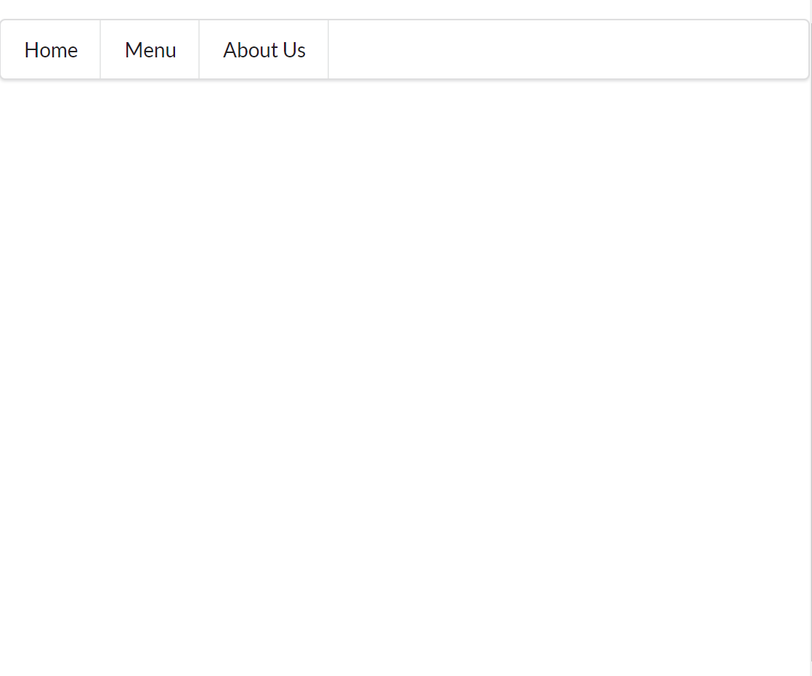

If you were wondering based on the title, yes, I can actually code a navbar in under a minute. I did it specifically for this and it ended up being exactly 39 seconds. It was also only done in my HTML file!
```HTML
  <div class="ui menu">
    <a class="item">Home</a>
    <a class="item">Menu</a>
    <a class="item">About Us</a>
  </div>
```
 <br>
While it is not functional (adding the links for reference would take a bit more time) nor pretty, it at least *looks* like a navbar. Since last summer, I've been trying to learn HTML and CSS on my own because I wanted to explore web design. During my journey, I attempted to make a navigation bar and looking back at my result, it was just ... pure pain. The navbar and its respective code above is all thanks to the wonderful Semantic UI, a user interface framework that makes front-end development so much smoother. I'm so glad I was introduced to Semantic UI because now, those painful days with raw HTML and CSS are over. (Though, that's not to say that I'll never have stress from Semantic UI because I definitely have experienced *severe* frustration already.) 

## Things I Love About Semantic UI
There are **SO** many great things about Semantic UI! Firstly, the time that it takes to create clean web designs is exponentially decreased if you use Semantic UI. Since Semantic has containers with decent spacing, you don't need to fiddle as much with CSS. Semantic uses a standard language so it is much easier to remember terminology and apply it to your project. You save time because you don't have as much terms to remember when formatting with Semantic compared to raw CSS. Secondly, the layouts created by Semantic UI with minimal additional CSS are much more aesthetically pleasing. The spacing of containers and grids are so attractive to the eye and the different buttons and icons you can add to a web page is bountiful. Lastly (this is my favorite part), Semantic UI uses natural language which is very human human-friendly. Because of this, it is easy to guess the names of states and variations in the HTML. For example, if you want to make a red button, you would put "ui red button," which is self explanatory. This has saved me time because I don't need to always reference the Semantic UI documentation.

## Semantic UI Limits
From an artist's point of view, Semantic UI may seem a bit restrictive and limiting. Using Semantic UI is indeed faster when creating websites but I think using raw HTML and CSS is better if you want to create a website that is more unique. There are many ways you can customize a website with Semantic but sometimes you need to override the Semantic code by applying `!important` which is not always safe because the Semantic may still take precedence over your modification if it also uses `!important`. While looking for websites to recreate, I found that I had to dismiss some because I didn't think I could replicate all the features with Semantic. However, although there are some limits for using Semantic UI, I find that my positive experiences outweighed the cons that I faced. 
