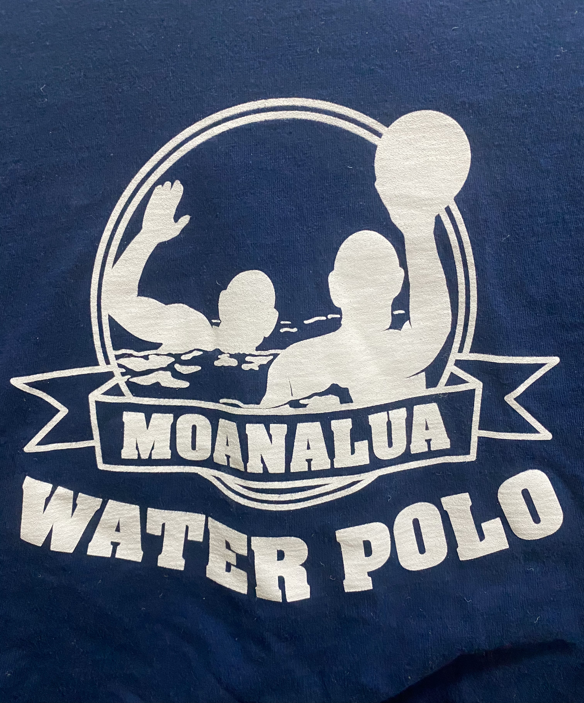

  

In my senior of high school, I was tasked with designing the team shirt and sweatpants for the Moanalua High School Water Polo team. At the time, I was a graphic design class that focused on production. In that class, I learned how to design and print stickers and decals as well as heat press and screen print designs onto clothes. 

First, I was asked by my coach to design the team shirt. In the beginning, I thought it was going to be an easy task that I could finish in two days tops. However, I was wrong. The first problem was inspiration. I had a hard time coming up with designs that were simple but pleasing to the eye. The second problem was communication. It was hard to get input from all my teammates in a timely manner. Some would reply in minutes, some in hours, and a few even took days. This was stressful because my coach told me I had about a week and a half to get everyone to agree to a design. If we couldn't, he would design it himself. 

As a tradition, the coach lets the team decide whether they want hoodies or sweatpants for that season. That year, the team decided that they wanted sweatpants and I was given the task of designing and producing them. First, I needed to find plain sweatpants that were affordable and comfortable. I ended up finding some Hanes sweatpants that were on sale and let the team choose between the available colors. I ordered them in bulk after getting everyone's sizes. Meanwhile, I designed each player's sweatpants with the Moanalua High School logo and their number. After all the sweatpants arrived, I finalized the design and printed them onto heat press vinyl. Then, I cut out each design and ironed the design onto their respective sweatpants. Finally, I distributed them to my teammates.

This project allowed me to experience what it would be like to design and produce a product for clients. It was really cool to be able to use the skills I learned in class and apply them. It was rewarding to see my team's reaction to their sports gear. 

