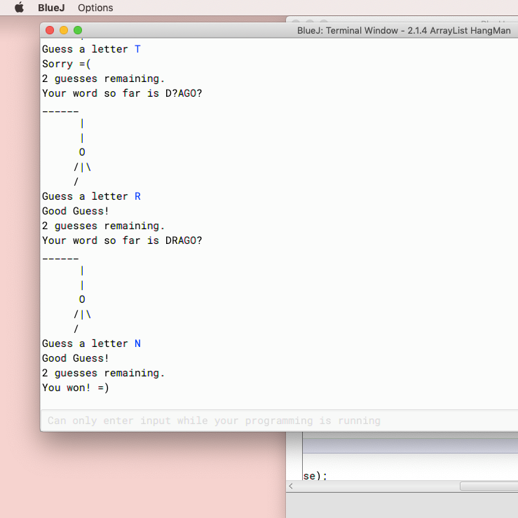

Kupukupu was the name of my group in the Hacking 4 Recovery bootcamp that was hosted by UH. Our idea was to create a browser extention that would help customers find second-hand options for clothes, furniture, etc. while online shopping. The idea was to create something that combined Honey, a browser extention that helps you save money, and thredUp, a company that sells second-hand clothes in great condition. The project helped me learn how to collaborate with a group as well as how to interview someone properly.

During the 5 day bootcamp, my team members and I interviewed more than 50 people. We first interviewed those who were close to us and nearing the end, we started interviewing strangers who we thought would be interested in our idea. As the week passed, I got more comfortable talking to strangers and I got better at promoting our idea. 

In this project I gained experience with entrepreneurship, business models, and communication. Tailoring interview questions to fit our target audience taught me how to ask the right questions and the mandatory 10 interviews per day forced me to talk to others and 'sell' our idea. 

