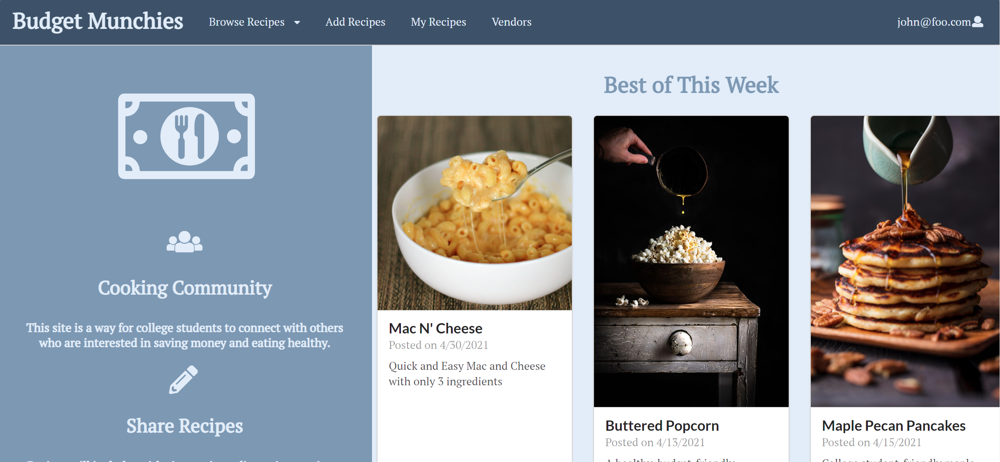

  

## Objective
For the final project of my Software Engineer I class, I worked together with three other people to create a functional website that would allow college students to share recipes in a community and connect with vendors in the university's area. Functions we included for users were the ability to add a recipe, like a recipe, view your own recipes and edit them if needed, browse through a variety of recipes posted by the community, view vendors and leave comments of their experience with them. We were given   weeks to have a final project so in order to get work done, we assigned three people wo work on the website and the other person to do the home page and testing. 

## The Process
One thing that I found really important for this project was applying the Agile Project Management practice: Issue-Driven Project Management. Issue-Driven Project Management (or IDPM) is a way for teams to efficiently create and divide tasks amongst themselves. Those who are more comfortable with design will work more on the frontend side while those who enjoy databases can focus on backend tasks more. This type of project management allows you to grow even more proficient in the skills you're good at while still being able to learn the concepts that you struggle in. 

## End Results
Although there were many bumps along the road, my group and I eventually ended up with a product that I am pretty proud to have contributed to. This experience has especially taught me how to persevere whenever problems arise. While not ideal, I found that experiencing the frustration is all part of the process. 

If you'd like to view my group's website, click [here](https://budgetmunchies.xyz/#/). Our homepage can be found [here](https://budget-munchies.github.io/) and our source code can be found [here](https://github.com/budget-munchies/budget-munchies-project).
